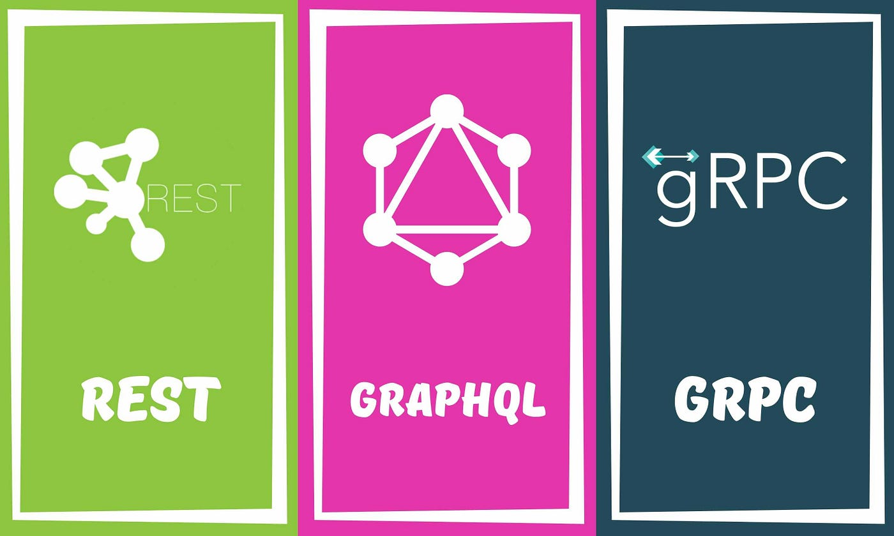
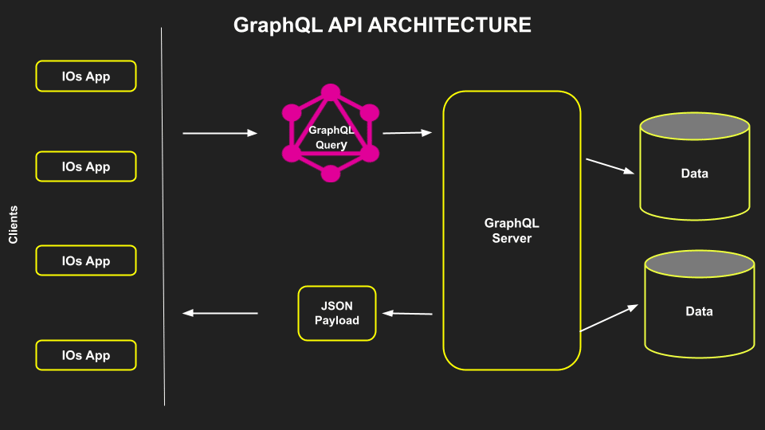
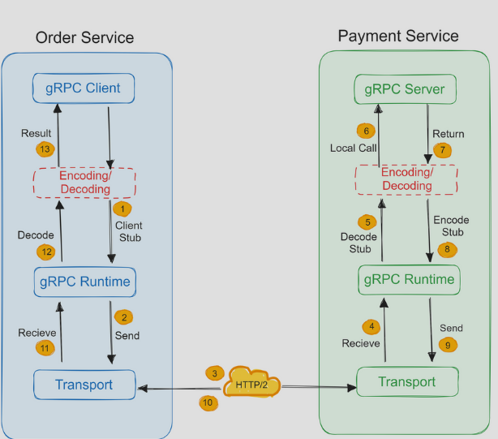

# REST-GraphQL-gRPC



A good API design is always crucial to any system. It's also important to pick the right API technology. In this tutorial, we will briefly discuss different API technologies: **REST**, **GraphQL**, and **gRPC**.

## What's an API?

An **API (Application Programming Interface)** is a set of definitions and protocols for building and integrating application software. It's often described as a contract between an information provider and an information user, specifying the content required from the producer and the consumer.

In simpler terms, APIs help you communicate with a system to retrieve information or perform functions.

## REST

### Overview


A **REST API** (Representational State Transfer) is an API that conforms to the REST architectural style. It interacts with RESTful web services and was introduced by Roy Fielding in 2000.

In REST, the fundamental unit is a **resource**.

### Key Concepts
- **Uniform Interface**: Consistent way of interacting with the server.
- **Client-Server**: Managed through HTTP.
- **Stateless**: No client context is stored between requests.
- **Cacheable**: Responses indicate if they can be cached.
- **Layered System**: Composed of multiple layers.
- **Code on Demand**: Supports executable code for applications (optional).

### HTTP Verbs
- **GET**: Retrieve resource representation.
- **POST**: Create a new resource.
- **PUT**: Update a resource entirely.
- **PATCH**: Modify a resource partially.
- **DELETE**: Remove a resource.

### HTTP Response Codes
- **1xx**: Informational.
- **2xx**: Success (e.g., 200 OK).
- **3xx**: Redirection.
- **4xx**: Client error (e.g., 404 Not Found).
- **5xx**: Server error (e.g., 500 Internal Server Error).

### Advantages
- Simple and easy to understand.
- Flexible and portable.
- Strong caching support.
- Decoupled client-server architecture.

### Disadvantages
- Over-fetching of data.
- Multiple round trips may be needed.

### Example
| URI         | HTTP Verb | Description            |
|-------------|------------|------------------------|
| `/users`    | GET        | Get all users          |
| `/users/{id}`| GET        | Get user by ID         |
| `/users`    | POST       | Create a new user      |
| `/users/{id}`| PATCH      | Update a user by ID    |
| `/users/{id}`| DELETE     | Delete a user by ID    |

## GraphQL

### Overview


**GraphQL** is a query language for APIs and a server-side runtime that prioritizes retrieving exactly the data requested by clients, and no more. It was developed by Facebook and open-sourced in 2015.

In GraphQL, the fundamental unit is a **query**.

### Key Concepts
- **Schema**: Describes available functionality on the server.
- **Queries**: Client requests for specific data fields.
- **Resolvers**: Functions that generate responses for GraphQL queries.

### Advantages
- Eliminates data over-fetching.
- Strongly defined schema.
- Supports code generation.
- Optimized payloads.

### Disadvantages
- Shifts complexity to server-side.
- Difficult caching.
- Ambiguous versioning.

### Example

**Schema:**

```graphql
type Query {
  getUser: User
}

type User {
  id: ID
  name: String
  city: String
  state: String
}
```

**Query:**

```graphql
{
  getUser {
    id
    name
    city
  }
}
```

**Response:**

```json
{
  "getUser": {
    "id": 123,
    "name": "Karan",
    "city": "San Francisco"
  }
}
```

## gRPC

### Overview



**gRPC** is a modern open-source high-performance Remote Procedure Call (RPC) framework that runs in any environment. It supports load balancing, tracing, health checking, authentication, and more.

### Key Concepts

- **Protocol Buffers**: Efficient data serialization format.
- **Service Definition**: Define services and RPC methods with parameters and return types.

### Advantages

- Lightweight and efficient.
- High performance.
- Code generation support.
- Bi-directional streaming.

### Disadvantages

- Steep learning curve.
- Limited browser support.
- Not human-readable.

### Example

**Proto Definition:**

```proto
service HelloService {
  rpc SayHello (HelloRequest) returns (HelloResponse);
}

message HelloRequest {
  string greeting = 1;
}

message HelloResponse {
  string reply = 1;
}
```

## REST vs GraphQL vs gRPC

| Type       | Coupling  | Chattiness | Performance | Complexity | Caching | Codegen | Discoverability | Versioning |
|------------|-----------|------------|-------------|------------|---------|---------|-----------------|------------|
| REST       | Low       | High       | Good        | Medium     | Great   | Bad     | Good            | Easy       |
| GraphQL    | Medium    | Low        | Good        | High       | Custom  | Good    | Good            | Custom     |
| gRPC       | High      | Medium     | Great       | Low        | Custom  | Great   | Bad             | Hard       |

## Conclusion

There is no one-size-fits-all solution when choosing an API technology. Each has its strengths and weaknesses, so it's crucial to consider your specific use case and system requirements when making a decision.
```
This structured `README.md` file presents the key concepts of REST, GraphQL, and gRPC in an organized and easy-to-read format.
```
